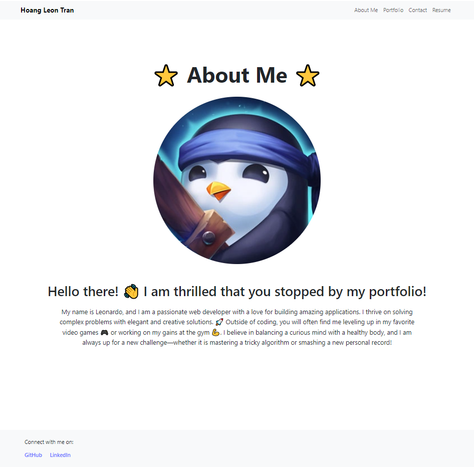
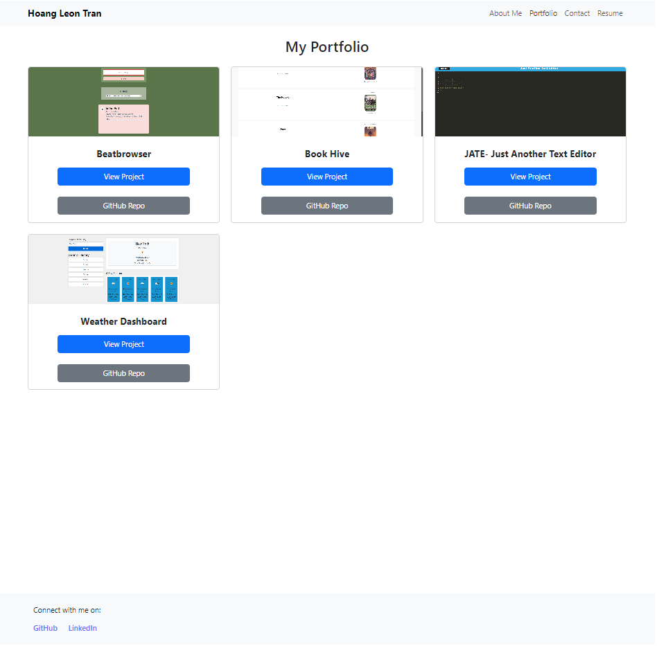
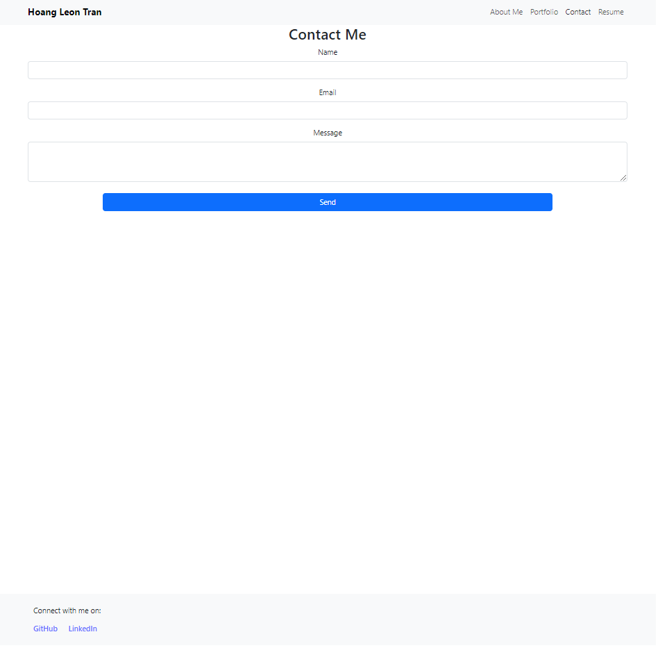
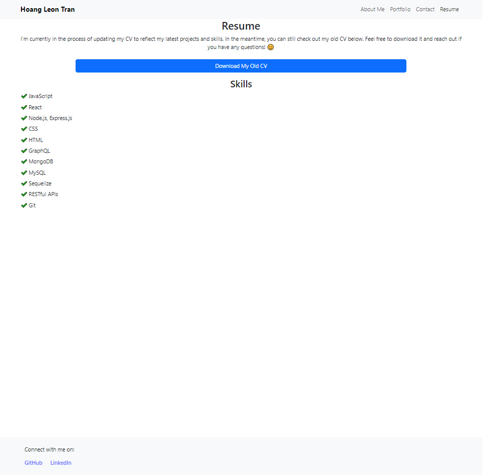

<div align="center">
  
  # Simple React Portfolio
  > Personal Web Developer Portfolio

[](https://reactjs.org/)
[](https://getbootstrap.com/)
[](https://vitejs.dev/)
[](https://app.netlify.com/sites/leon-tran-react/deploys)

</div>

## Description

This repository contains the code for my **Personal Web Developer Portfolio**. The portfolio is a single-page React application built with Bootstrap and Vite, and showcases my projects, skills, and provides contact information.

### Website

The live application can be accessed [here](https://leon-tran-react.netlify.app/).

#### Sample Screenshot:






### Key Features:

-   **Responsive Design**: Built with a mobile-first approach and responsive Bootstrap classes.
-   **React Components**: Efficient and reusable components for projects, navigation, and more.
-   **Interactive Elements**: Features a contact form with input validation and interactive navigation.
-   **Portfolio Section**: Displays titled images of projects with links to deployed applications and GitHub repositories.

## Installation

To run this application locally, follow these steps:

1. **Ensure Node.js is Installed:**

    You will need Node.js installed on your computer. Check if you have Node.js by typing `node -v` in your command line. You should see a version number. If Node.js is not installed, visit the [Node.js website](https://nodejs.org/en) to install it.

2. **Clone the Repository:**

    ```bash
    git clone https://github.com/yourusername/simple-react-portfolio.git
    cd simple-react-portfolio
    ```

3. **Install Dependencies:**

    ```bash
    npm install
    ```

4. **Start the Application:**

    ```bash
    npm run dev
    ```

    This will start the Vite development server and open the app in your browser.

5. **Access the Application:**

    Open your browser and navigate to `http://localhost:3000`.

## Usage

1. **Navigation**: Browse through different sections using the navigation bar.
2. **Projects Section**: Click on "View Project" to see the deployed version or "GitHub Repo" to view the source code.
3. **Contact Form**: Fill out the contact form to reach out, with validation for each field.
4. **Resume Section**: Download the resume provided in the resume section.

## License

[MIT License](https://opensource.org/licenses/MIT)

## Contact

-   **GitHub**: [leontran44](https://github.com/leontran44)
-   **Email**: [Leon Tran](mailto:leontran44@gmail.com)
-   **LinkedIn**: [Leon Tran](https://www.linkedin.com/in/hoangqtran/)
